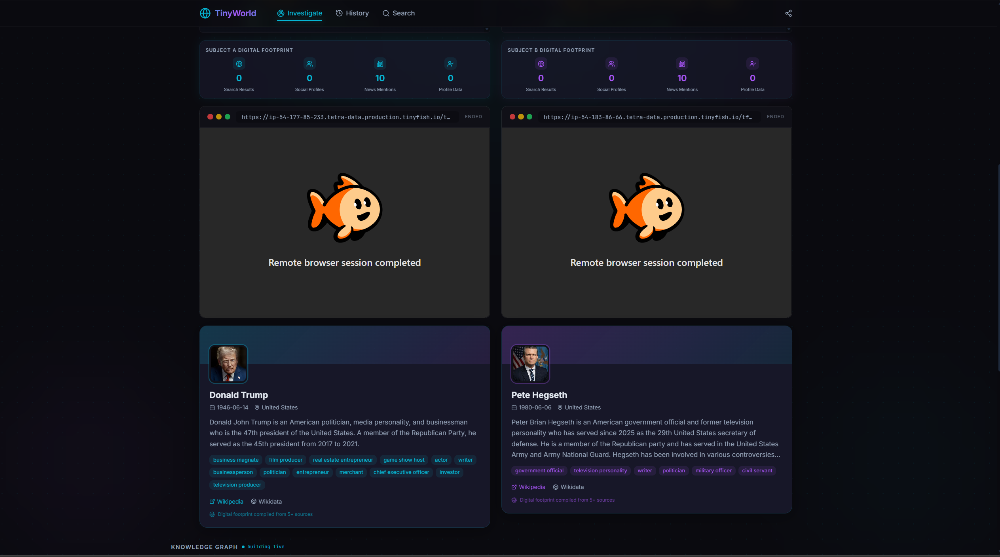
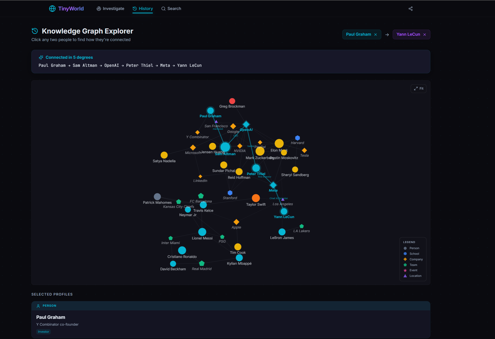
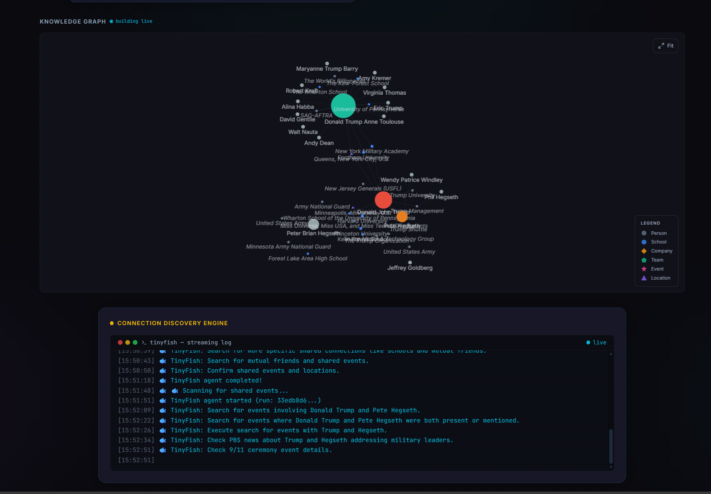

# TinyWorld

### "It's a small world after all... but HOW small exactly?"

You finally matched with someone cute. They seem perfect. Same taste in music, same dumb sense of humor, suspiciously similar nose.

Before you shoot your shot — **wouldn't it be nice to know if you're somehow, distantly, awkwardly related?**

TinyWorld maps the connections between people so you can find out just how many degrees of separation stand between you and that special someone. Or your coworker. Or your coworker's coworker who you keep making awkward eye contact with at the coffee machine.

---

## What it does

- **Search** for any person and build out their connection graph
- **Visualize** relationships as an interactive network — see exactly how everyone links up
- **Find the path** between two people (Kevin Bacon style, but make it romantic and/or horrifying)
- **Browse connection history** so you can revisit your previous existential discoveries

### Dual-Agent Search with Live Browser Streams

Two AI agents search simultaneously — each with its own stealth browser you can watch in real time.



### Knowledge Graph Explorer

Click any two people in the graph to instantly find the shortest path between them. Nodes are color-coded: people, companies, schools, teams, events, and locations.



### Live Graph Building + Connection Discovery

Watch the knowledge graph build in real time as agents discover entities. The connection discovery engine chains TinyFish searches to find co-mentions, shared organizations, and events.



---

## How it actually finds stuff

Normal scrapers get blocked. LinkedIn says no. Google says slow down. Wikipedia is fine but it only knows so much.

That's where **[TinyFish](https://tinyfish.ai)** comes in.

TinyFish spins up a real stealth browser and navigates the web like a human would — searching DuckDuckGo, scraping LinkedIn profiles, reading news articles, hunting down social media — all without getting rate-limited into oblivion. It streams what it's doing back to you in real time, so you can watch a little fish swim through the internet on your behalf.

For each person you search, TinyFish runs **three parallel hunts**:
1. A general web search to find who they are
2. A social media sweep (LinkedIn, Twitter, etc.) to find their profiles
3. A news scan to find recent mentions

Then it scrapes the best profile it found and extracts structured data: schools, jobs, organizations, key associates. That's what becomes the nodes and edges in your graph.

When you're finding the path between **two** people, TinyFish runs another round: looking for co-mentions, shared organizations, and events where both showed up. It's basically doing the gossip research you'd do yourself if you had three browser tabs open and too much time.

---

## Stack

| Layer    | Tech                          |
|----------|-------------------------------|
| Frontend | React + TypeScript + Vite     |
| Styling  | Tailwind CSS                  |
| Graphs   | react-force-graph-2d          |
| Backend  | Python + FastAPI              |
| Browser agent | TinyFish (stealth, SSE streaming) |
| Fallback data | Wikipedia + Wikidata + Google |

---

## Getting started

**Backend**
```bash
cd backend
pip install -r requirements.txt
python main.py
```

**Frontend**
```bash
cd frontend
npm install
npm run dev
```

---

## Disclaimer

TinyWorld is not responsible for:
- Ruined crushes
- Accidental family reunions
- The realization that your entire social circle went to the same three colleges
- Any feelings of "wait, we've met before"
